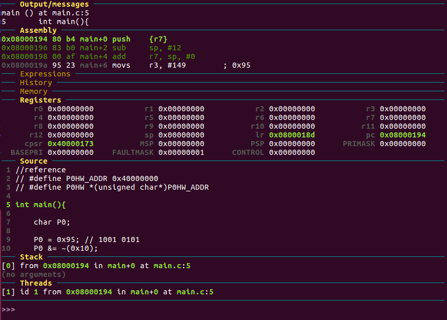
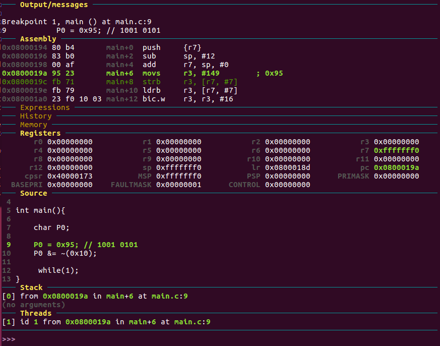
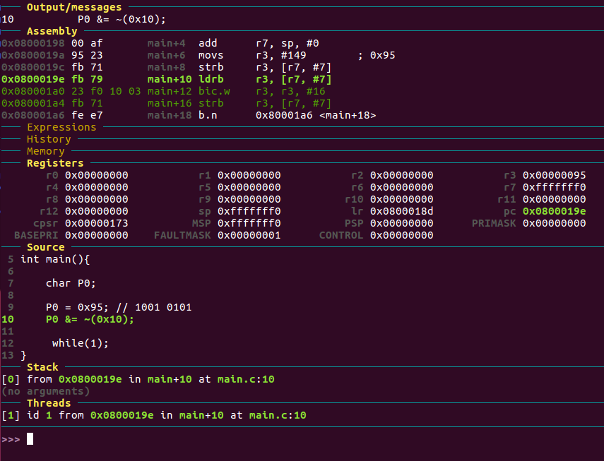

### 21/04/01 (목)
---------------------------

db memory watch 0xfffffff0


디버깅 실행
1. make gdb
2. target remote:1234
3. file out.elf
4. load
5. b main
6. si(인스트럭션 단위로 진행), s(줄 단위로 실행), n(함수단위로 실행)

----------------------------
# 1. 복습
## 1. C 코드를 ARM cortex-m4 프로세서용으로 컴파일하고, 이를 프로세서 위에 로딩 후 (QEMU virtualization) 온칩에서 실행되는 과정을 gdb를 이용하여 step instruction 추적을 통해 실행과정을 분석하시오.

0. 소스코드 내용

    ```c
    int main(){
    
        char P0;
        
        P0 = 0x95; // 1001 0101
        P0 &= ~(0x10);
        
        while(1);
    }
    ```

    - P0에 0x95를 저장 후 P0의 5번째 비트를 0으로 바꿔주는 간단한 프로그램

1. ARM cortex-m4 프로세서용으로 컴파일

    ```Makefile
    make all
    make bin
    ```

    

    - -mcpu=cortex-m4 : 타겟 프로세서를 cortex-m4로 지정.

    - -mthumb : Trace32 디버깅 프로그램 사용.

    - -mfloat-abi=hard : 사용할 부동 소수점 ABI를 지정. hard 옵션은 부동 소수점 명령어 생성을 허용하고 FPU 별 호출 규칙을 사용.

    - mfpu=fpv4-sp-d16 : 부동 소수점 하드웨어 (또는 하드웨어 에뮬레이션)를 지정.

2. QEMU 가상머신 실행

    ```
    make qemu
    ```

3. gdb로 파일 로드

    ```
    make gdb

    target remote:1234  -> hvm 연결
    
    file out.elf
    load                -> 파일 로드

    b main              -> break point main으로 지정
    ```

4. 단계별로 실행

    ```
    si
    ```

    - step instruction의 약자로 명령어 단위로 단계별로 실행

    -----
    
    
    sp -12만큼 이동
    r7에 sp의 주소를 저장
    왜 12 이동? 여기서 12의 메모리에는 시스템의 기본적인 필요요소들이 저장되어 있다. 예약된 메모리 개념?

    
    
    r3에 149를 저장
    그리고 r3의 값을 r7에 있는 주소 + 7에 저장

    
    
    r3에 r7의 주소(sp) +7 에 저장된 값 불러와서 저장
    r3값과 16 and연산 후 r3에 저장
    r3값을 r7의 주소(sp) + 7에 저장

    

    반복문 분기하며 시행 


-----------------------------
## 2. C로 코딩하는 다양한 사례별로 Assembly code로 변환되어 실행되는 원리를 분석하시오. 

1. 변수에 값 저장

2. 변수끼리 더하기 연산, 빼기 연산

3. 조건문

4. 반복문

5. 함수 호출

    - 함수 call과 return 과정에서 stack 메모리와 레지스터가 어떻게 사용되는지 분석


---------------------------